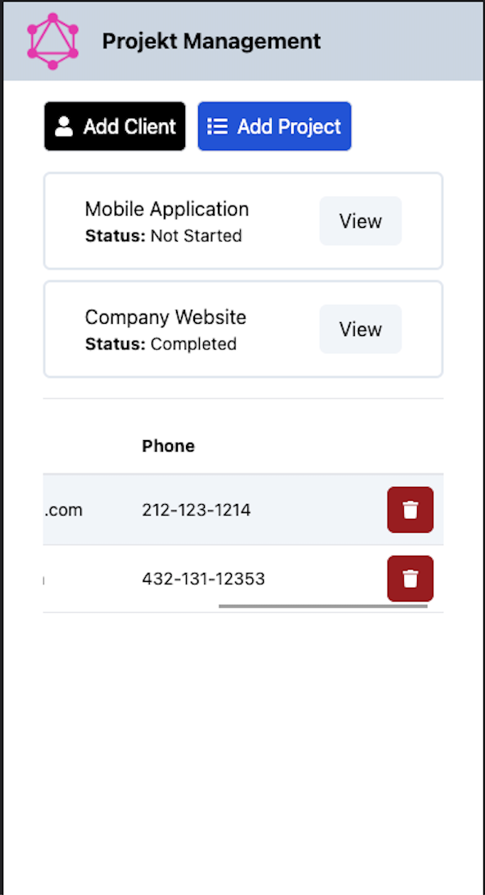
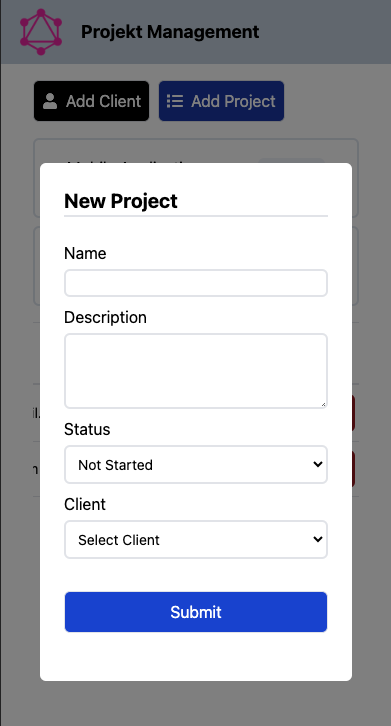
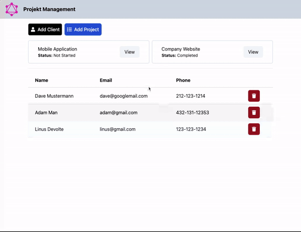

# graphql-project-manager

This project was just to try out GraphQL. It is a simple project management app built with vite React, Typescript, Tailwind and Apollo CLient on the frontend - GraphQL, Node and Express on the backend, MongoDB as DB.

### Mobile

    
    

### Functionality Gif

